# Twin Matcher - Find Your Lookalike 🌟

Welcome to Twin Matcher, your gateway to discovering your celebrity doppelgänger! 🔍 This is the final project for the **ID2223 - Scalable Machine Learning & Deep Learning** course at KTH. Notebooks and files are commented, to ensure the best accessibility.

## Overview 🚀

Twin Matcher leverages the power of the [Microsoft ResNet-50](https://huggingface.co/microsoft/resnet-50) model to find your lookalike. The system features a seamless pipeline that includes image preprocessing, data handling, model training, and inference. It allows you to visualize your prediction and upload your own data to become part of the dataset and find your long-lost twin. The system is designed for efficiency, minimizing the time from data acquisition to model improvement. By leveraging continuous integration practices, the pipeline is both robust and capable of handling large volumes of data without sacrificing performance. We ensure to get coherent batch updates and the best possible matches with continuous model retraining.

## Tools 🛠️

This project is built around a complex system pipeline that ensures efficiency and effectiveness, exploiting the capabilities of different tools and platforms:

- **Microsoft ResNet-50 Model**: Our project utilizes the Microsoft ResNet-50 model, a deep convolutional neural network (CNN) known for its exceptional facial feature extraction capabilities, fitting for this task.

- **Gradio for User Interaction**: Gradio, a user-friendly machine learning interface, connects users with our AI pipeline. It enables seamless image uploads and interactions with our system.

- **Hugging Face Datasets and Models**: Twin Matcher leverages Hugging Face for dataset hosting and model management, promoting collaboration and data sharing within the AI research community.
- **Amazon S3**: The selected Cloud object storage service that offers industry-leading scalability, data availability, and security.
- **GitHub + Github Actions**: Serverless platform for code hosting, versioning, and scheduled executions.
- **Google Colab**: Hoster service for model on-demand training.

A high-level illustration of the system pipeline can be visualized here:

<!-- System -->

  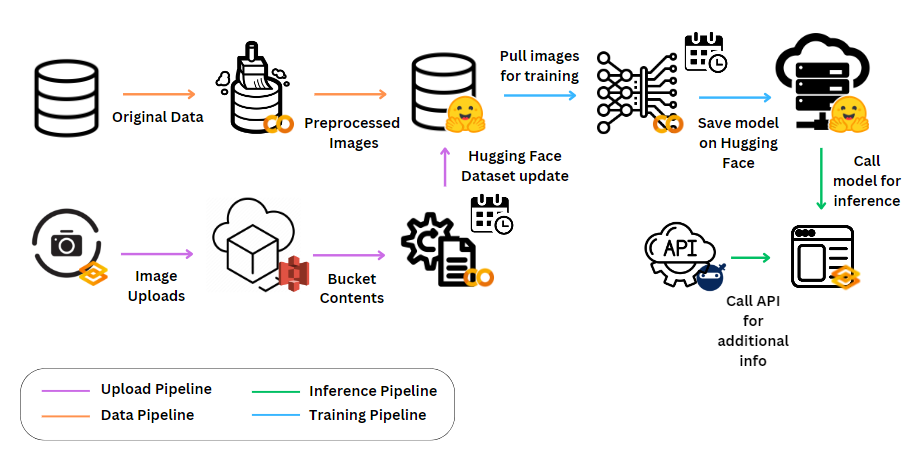

## How It Works 🤖

### 1. Data Preprocessing Notebook 📷
**Objective**: Transform original dataset images into a refined format suitable for machine learning models. The notebook preprocesses the original dataset, [lansinuote/simple_facenet🤗](https://huggingface.co/datasets/lansinuote/simple_facenet), and makes it fit for training image classification networks. It solves class imbalance, checks for label coherence, and uploads the new dataset on the [Hugging Face Platform🤗](https://huggingface.co/datasets/SaladSlayer00/twin_matcher_data), ensuring it keeps the right format. This allows the data to benefit from the functionalities offered by the datasets library, and easy retrieval thanks to full integration with the rest of the environment. The image dataset is composed of a DataDict of images (which are [160 x 160] cuts of faces of various celebrities) and labels (the associated celebrity names). There's a total of 105 initial identities, each presenting 85 images in the training split. 
<!-- Image -->

  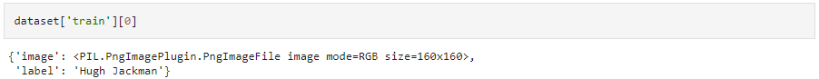
  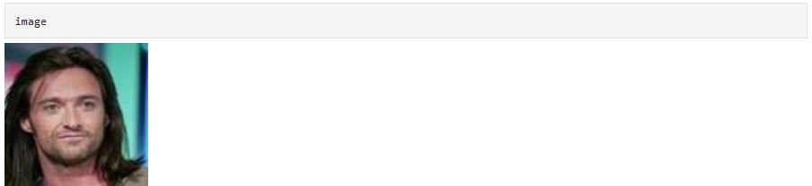

### 2. Image Upload Pipeline 🚢

The **Upload Pipeline** lets users upload videos through a [Gradio app](https://huggingface.co/spaces/SaladSlayer00/image_upload). They should be 5-6 seconds videos of the user's face, including rotations from both sides. Since uploading numerous, high-quality images would be a cumbersome task for users, we have opted to capture frames from these videos, identifying faces and associating them with user names that are taken as inputs. The frames are obtained with opencv, and saved every 100 milliseconds as default. Of course, since the original dataset was preprocessed to only include images that are 'good' for training, so close-up cuts of faces, the inputs need to be preprocessed in the same way. A video that presents good characteristics of resolution and movement can provide around 50 images with the current settings. This operation is easily performed with the `CascadeClassifier`, which detects faces' bounding boxes. Its hyperparameters have been tuned to obtain a good balance of the quantity of images and the correctness of face recognition (they cannot however make faces less ugly...). 
<!-- Image -->

  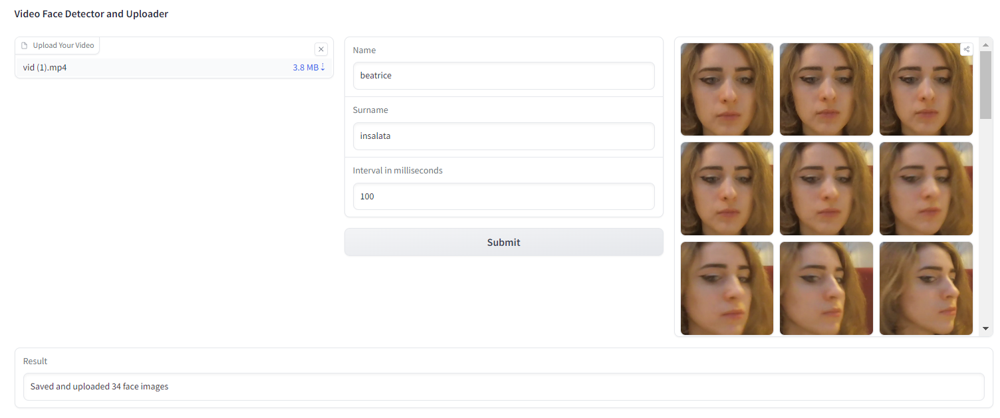

The processed images are uploaded to an Amazon S3 bucket. This operation is made possible by the setting of secret keys in the Hugging Face space of the app, which allows for direct communication with the platform. The execution of the app creates a new folder in the bucket with the title 'name_lastname' inserted by the user, and containing the captured images as `.png` files.
<!-- Image -->

  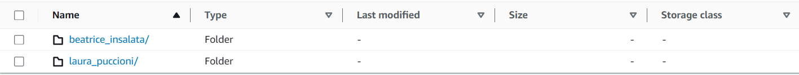
  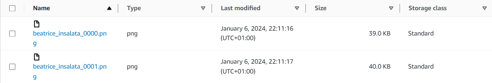

### 3. Image Pipeline Python Program 🐍

Periodically, the **Image Pipeline Python Program** pulls images from the S3 bucket to process its contents. The design choice for AWS S3 is predicated on its proven durability, high availability, and scalable storage infrastructure, which aligns with the project's requirements for handling expansive datasets. This Python script is scheduled to run at regular intervals, thanks to GitHub Actions workflow automation. It's interfacing both with the S3 bucket to retrieve and process the latest image data and with the Hugging Face platform to update the dataset with the latest classes. This script is integral to the image pipeline, responsible for verifying image integrity, standardizing formats, and preprocessing images for compatibility with the ResNet-50 architecture. This preprocessing step includes reformatting, splitting, and color correction to maintain consistency across the dataset.

Once the images are processed, they are dynamically integrated into an existing Hugging Face dataset. The module accomplishes this by first segregating the images into training and testing subsets, ensuring a balanced distribution that facilitates effective machine learning model training. The process utilizes the `datasets` library from Hugging Face, taking advantage of its efficient handling of large-scale datasets and its compatibility with Hugging Face's model hub, which is necessary for smoothly performing training. First, the images are presented in the dictionary format needed for compatibility, then the original set is concatenated with the latest segment, effectively creating a new version that will replace the oldest. This system can benefit from version control thanks to GitHub Actions job management and Hugging Face history settings. GitHub Actions allows for periodic scheduling through the definition of cron syntax expressions in the dedicated `.github/workflows/main.yml` file. The scheduled execution is performed through [👉this repository](https://github.com/SaladSlayer00/image_pipeline/tree/main).

The dataset update mechanism within this module allows for the dataset to grow iteratively, reflecting the ingestion of new data. The dataset is pushed to the Hugging Face hub using their `push_to_hub` method, which seamlessly updates the repository and ensures that the model training pipeline has access to the latest data. The update is a **batch update**, both given the inherent non-real-time nature of the project and the lengthy time needed for performing an entire end-to-end pipeline. With the current settings, the pull is performed once per month, so that the dataset can be available not too long after the last upload. The dataset where images are added, and that will be used for training, is on [Hugging Face 🤗](https://huggingface.co/datasets/SaladSlayer00/twin_matcher_data/viewer/default/train?p=90)., and is accessed via GitHub Actions workflow thanks to an environment secret token, to avoid manually setting permissions every run.

### 4. Training Pipeline 🎯

The training pipeline has the task of fine-tuning the ResNet-50 model available on Hugging Face for adapting it to the recognition of celebrity (and later, user) faces. The pre-trained neural network is available through the `transformers` library. The process begins with the environment setup, where the datasets and transformers libraries are installed, ensuring that the latest versions compatible with the project's requirements are in place.

With the setup complete, the notebook proceeds to fetch the `SaladSlayer/twin_matcher_data` dataset from the Hugging Face repository. This dataset is composed of a curated set of celebrity images organized for image recognition tasks, and later will present the uploaded and preprocessed user images and their names. The initial preprocessing step leverages the AutoFeatureExtractor, which is fine-tuned to the model's expected input format, including image resizing and normalization based on the mean and standard deviation of the pixel intensity values. These steps are necessary to ensure data is fitting for model input: the original set did not present the information encoded in `pixel_values`, which are needed for training, thus model-specific transformations were performed here, to maximize reusability and compatibility.

The technical core of the notebook is the fine-tuning of the ResNet-50 model. Here, the notebook delineates how the model, which utilizes residual learning for efficient training of deep networks, is adapted from its pre-trained state to the specific classification task. This involves adjusting the final classification layer to the dataset's unique label set and configuring the training parameters, including batch size and learning rate.

The optimization strategy selected is the AdamWeightDecay optimizer, chosen for its efficacy in handling the delicate balance between learning rate and regularization via weight decay. The training and validation splits are constructed using TensorFlow datasets, which are then batched and preprocessed to be compatible with the model's input expectations.

Throughout the training phase, a custom callback is used to compute and record the accuracy metric on the validation set at the end of each epoch. This allows for real-time performance tracking. Additionally, a TensorBoard callback is employed for detailed logging, and a PushToHubCallback is used to ensure that the model's state is regularly committed to the Hugging Face Hub, facilitating reproducibility and version control.  Checkpoints are pushed to the Hub to make the model exploit the outcomes of previous operations. The original number of training epochs is 35, which strikes a balance between overfitting and accuracy, while later re-training runs are reduced to 10 epochs. The learning rate is 5e-5, which allows to avoid getting stuck on suboptimal regions and increase convergence speed.

The fine-tuning process iterates over several epochs, each providing empirical feedback that informs the optimization of model parameters. After training, the model is evaluated on the validation set, and the loss metric is carefully analyzed to assess the fine-tuning's efficacy. We can see that the model keeps a steadily increasing trend on `validation_accuracy`. Some overfitting happens, as evident in the training logs of the validation and training errors, and this aspect may require further attention to improve model performance, which however presents a satisfying outcome and can be employed for our task.
<!-- Image -->

  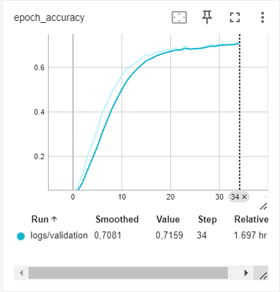
  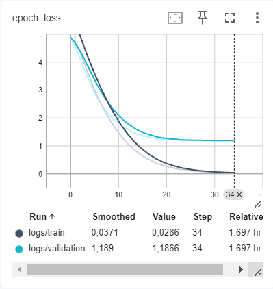

Finally, the notebook demonstrates an inference procedure using a sample image, showcasing the practical application of the fine-tuned model. The ResNet-50 model's output logits are interpreted to yield a predicted class, completing the end-to-end workflow from model adaptation to practical deployment.

<!-- Image -->

  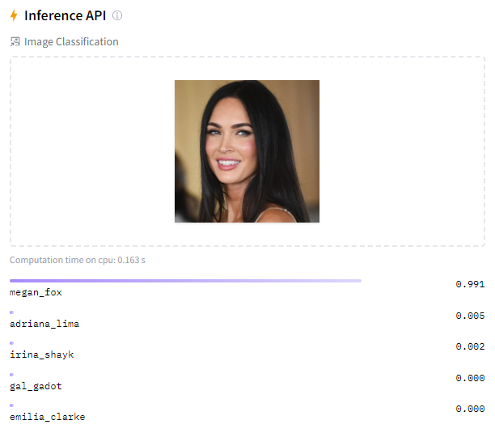

The training pipeline is available as a Jupyter notebook in `training_pipeline_notebook.ipynb`, which demonstrates and comments on each step of the process and allows for manual on-demand retraining (authentication 
credentials and checkpoint repositories need to be changed according to the user). However, the training also happens on  a periodic schedule via GitHub Actions, where the program executes to perform automatic updates 
and acquire knowledge on the new image dataset. The process is actuated through 👉[this repository](https://github.com/SaladSlayer00/training_pipeline), but may present limits due to the lack of memory and 
computational resources occasionally. The model we used for deployment is found on my [Hugging Face🤗](https://huggingface.co/SaladSlayer00/twin_matcher_beta). Training is executed on the whole dataset, and this 
approach is motivated by some reasons:
- **Data Drift**: the difference in the distribution of inference data, which might present substantial changes compared to historical data, requires more robustness to handle.
- **Batch Scheduled Retraining**: the update is done at relatively distant times, so that the computational load is not too intensive compared to an online updating algorithm, and allows for handling the full load of the data before the next iteration is repeated.
- **Sample Bias**: if the new data is not representative of the overall data distribution, the model may become biased towards recent trends.

### 5. Inference Pipeline
The Gradio app's inference pipeline for the Twin Matcher project is architected to process image inputs and match them with celebrity/user faces through a series of technical steps. Central to this pipeline is the deployment of a neural network-based image classifier, constructed and fine-tuned with the face classification model previously trained. The Gradio interface facilitates user interaction with the model: it is configured to accept image inputs in the form of user uploads or live camera snapshots. Example images of celebrities are also available to be prompt to the model. 

Once an image is uploaded, the inference pipeline kicks into action. The image is fed into the image classification pipeline, where the model predicts the most likely celebrity match based on facial features. The prediction logic involves extracting the top prediction from the model's output, which is then processed to retrieve the corresponding label and confidence score. This information is presented to the user to gain an indicator of the model's outcomes. To make the application more accessible and insightful, an image gallery is also shown where the face of the identified twin is shown in different pictures. The app can fetch and display similar images of the predicted celebrity from the original training dataset. This is handled by the `fetch_images_for_label` function, which filters the dataset for images corresponding to the predicted label, presenting users with visual comparisons to their uploaded image. This will make the user gain a clearer perspective on the suggestion, with the ability to visually spot similarities. In parallel, the app fetches additional information about the predicted celebrity, for a short description of their name, nationality, net worth, age, height, and occupation. This is achieved through a predefined function `fetch_info`, which queries an external API using the celebrity's name (prediction label). The function formats the received JSON string response into a human-readable HTML table, enriching the user experience with informative content about the celebrity match.
The Gradio app is equipped with error handling and debugging mechanisms, ensuring robustness and reliability, which were later removed in the deployed version. Any errors during the prediction or data fetching processes are caught, logged, and communicated.
The app is available [👉here](https://huggingface.co/spaces/SaladSlayer00/twin_matcher).

<!-- Image -->

  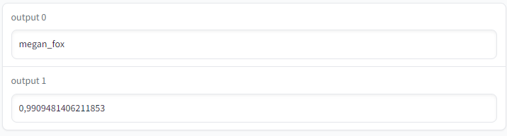
  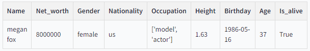

## Getting Started 🏁

If you want to experience the Twin Matcher as it was originally imagined, you can inspect various modules of the project!
1. **Inference App**: to find out who your twin is, simply access [this Hugging Face Space](https://huggingface.co/spaces/SaladSlayer00/twin_matcher) and run the app. Upload your picture or take a snapshot from the camera.
2. **Image Upload**: if you want to add your pictures to the dataset, access [this Hugging Face Space🤗](https://huggingface.co/spaces/SaladSlayer00/image_upload). Your pictures will be safely stored in Amazon S3 buckets and will be used for the next training iteration!
3. **Trigger Model Training**: if you wish to manually inspect our model training, simply access the `training_pipeline_notebook.ipynb`. Remove or edit the checkpointing directory to your own if you want to save the model to your own space.

Execute different components of the project, such as the data pipeline, image pipeline, and Gradio apps, as needed.

Enjoy the adventure of finding your twin with Twin Matcher! ✨
